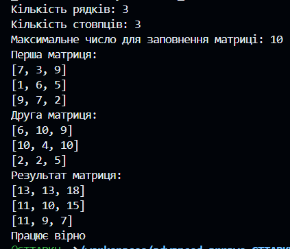

# Знайти суму двох матриць розміром N x M

## Обрахунок Суми

````java
public class CalculateSum {

    public static void SumCalc(int n, int m, int num) {
        int[][] FirstMatrix = new int[n][m];
        int[][] SecondMatrix = new int[n][m];
        int[][] Result = new int[n][m];

        fillMatrix(FirstMatrix, num);
        fillMatrix(SecondMatrix, num);

        for (int i = 0; i < n; i++) {
            for (int j = 0; j < m; j++) {
                Result[i][j] = FirstMatrix[i][j] + SecondMatrix[i][j];
            }
        }
        

        System.out.println("Перша матриця:");
        PrintMatrix(FirstMatrix);

        System.out.println("Друга матриця:");
        PrintMatrix(SecondMatrix);

        System.out.println("Результат матриця:");
        PrintMatrix(Result);
    }
````

## Результати
